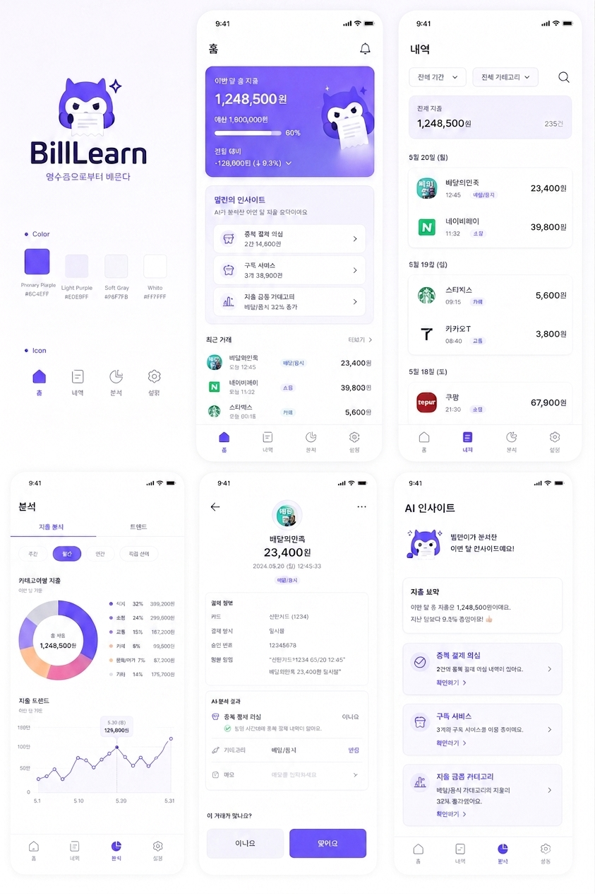
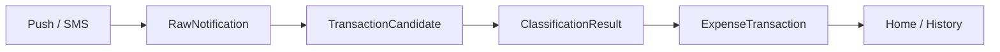
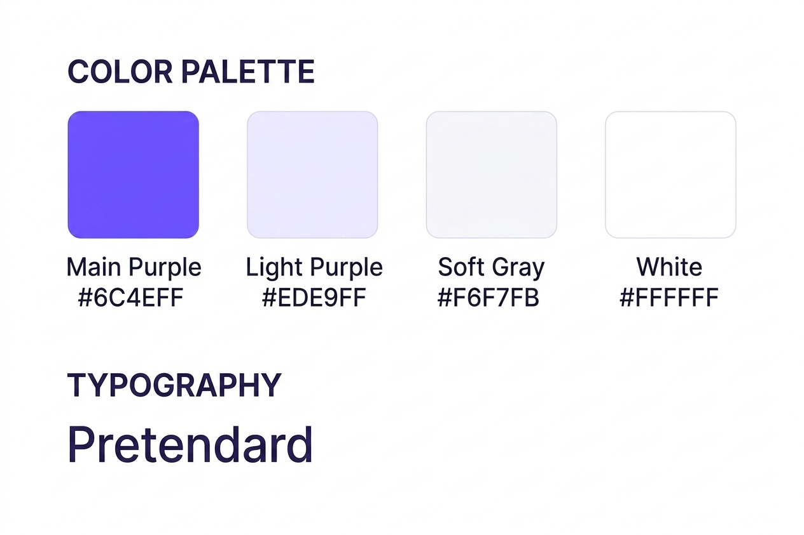
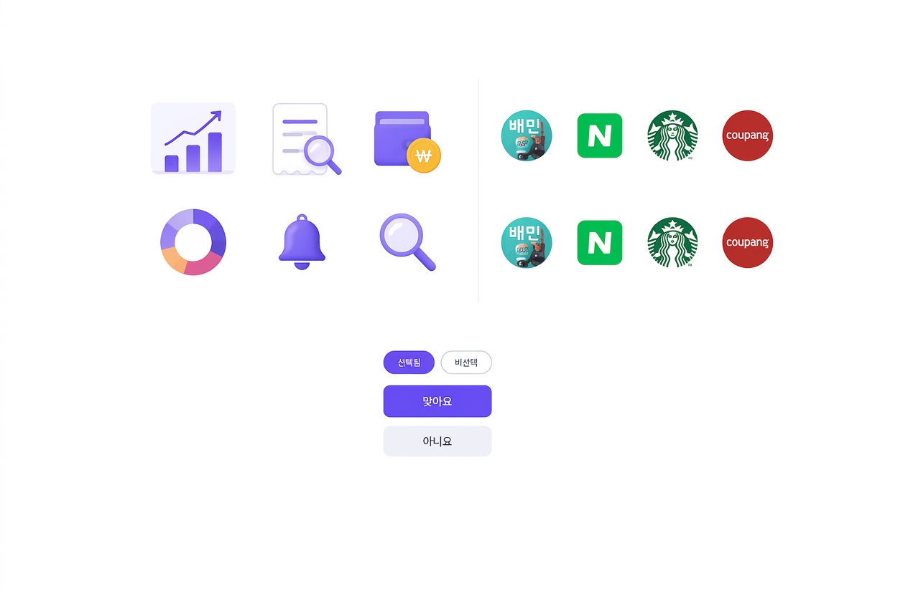

<p align="center">
  
</p>

<h1 align="center">BillLearn</h1>

<p align="center">
  영수증으로부터 배우는 자동 가계부
</p>

<p align="center">
  
  
  
</p>

---

## What Is BillLearn?

BillLearn은 카드사 푸시 알림과 결제 문자메시지를 분석해 **실제 지출만 정리하는 자동 가계부 앱**입니다.

일반적인 지출 내역 서비스는 계좌 간 이동, 충전, 이체, 중복 알림까지 지출로 계산하는 경우가 있습니다. BillLearn은 원본 알림을 그대로 합산하지 않고, 결제 후보를 한 번 더 판정해 사용자가 홈 화면에서 믿고 볼 수 있는 지출 기록을 만드는 것을 목표로 합니다.

첫 버전은 Android를 우선 지원합니다. Android에서는 사용자의 권한 허용을 통해 알림과 SMS 기반 자동 수집이 가능하기 때문입니다. 다만 앱 구조는 Flutter 기반으로 설계해, 이후 iOS와 서버 기반 데이터 소스(MyData, 금융 API 등)로 확장할 수 있게 가져갑니다.

## Product Preview

<p align="center">
  
</p>

## Core Flow



BillLearn의 MVP는 이 흐름에 집중합니다.

1. 결제 푸시 알림과 SMS를 수집합니다.
2. 원본 텍스트에서 금액, 가맹점, 시간, 결제 수단 힌트를 파싱합니다.
3. 중복 결제 알림, 계좌이체, 충전, 비지출 이벤트를 판정합니다.
4. 실제 지출로 확정된 거래만 저장합니다.
5. 홈과 내역 화면에는 정리된 실지출만 보여줍니다.

## MVP Scope

현재 MVP에 포함하는 것:

- Android 알림 접근 기반 결제 푸시 수집
- Android SMS 기반 결제 문자 수집
- 원본 알림과 최종 지출 데이터 분리
- 중복 결제 후보 판정
- 이체성 이벤트 판정
- 실제 지출 저장
- 홈, 내역, 상세, 설정 화면
- 로컬 저장 우선 구조
- 향후 서버 동기화를 고려한 repository 경계

초기 MVP에서 제외하는 것:

- 필수 회원가입
- 클라우드 동기화
- 예산 관리
- 고급 AI 소비 인사이트
- MyData 연동
- iOS 자동 수집

## Design Direction

<p align="center">
  
</p>

BillLearn은 화이트와 퍼플을 중심으로 한 밝고 신뢰감 있는 금융 앱 톤을 사용합니다.

- Main Purple: `#6C4EFF`
- Light Purple: `#EDE9FF`
- Soft Gray: `#F6F7FB`
- White: `#FFFFFF`
- Typography: Pretendard

<p align="center">
  
</p>

## Architecture

```text
app/
  lib/
    src/
      app/                 App shell, router, theme
      features/            Home, history, detail, settings screens
      domain/              Models, parser, classifier, use cases
      data/                Local persistence and repositories
      platform/android/    Android bridge for notification and SMS events
```

The app is built as:

- `Flutter`: shared UI, routing, app state, domain flow
- `Android Kotlin`: notification listener, SMS receiver, platform permissions
- `MethodChannel / EventChannel`: native-to-Flutter event bridge
- `Local-first storage`: MVP default, with future sync boundaries preserved

## Current Progress

Implemented:

- Flutter app scaffold under `app/`
- BillLearn app shell
- Brand theme
- `go_router` navigation
- Home, history, transaction detail, settings screen stubs
- Home smoke test

Next:

- Domain models
- Payment text parser
- Expense classifier
- Repository contract
- Android event bridge

## Development

This repository keeps a project-local Flutter SDK under `.tools/flutter`, which is ignored by git.

From the app directory:

```powershell
cd app
..\.tools\flutter\bin\flutter.bat test
```

Other useful commands:

```powershell
..\.tools\flutter\bin\flutter.bat analyze
..\.tools\flutter\bin\cache\dart-sdk\bin\dart.exe format lib test
```

## Documents

- [MVP Design](docs/superpowers/specs/2026-05-14-billlearn-mvp-design.md)
- [MVP Design Korean](docs/superpowers/specs/2026-05-14-billlearn-mvp-design.ko.md)
- [Implementation Plan](docs/superpowers/plans/2026-05-14-billlearn-mvp-implementation.md)
- [Implementation Plan Korean](docs/superpowers/plans/2026-05-14-billlearn-mvp-implementation.ko.md)
- [UI Screenshots](docs/ui-screenshots.md)
- [UI/UX Review 2026-05-19](docs/ui-ux-review-2026-05-19.md)
- [History UI Review 2026-05-20](docs/history-ui-review-2026-05-20.md)

---

<p align="center">
  
</p>
