# BillLearn UI Screenshots

이 문서는 에뮬레이터에서 확인한 현재 BillLearn UI 상태를 고정해두는 기준 자료입니다.

- 기준 기기: Android emulator `emulator-5554`
- 목적: 화면 polish 전후 비교, README/PR 설명, 다음 UI 개선 우선순위 판단
- 데이터 상태: debug sample 포함 화면과 앱 데이터 초기화 후 빈 상태 화면을 함께 보관

## Current Main Flow

### Home

홈 화면은 확정 지출 총액, 확인 필요 거래, 최근 지출을 한 화면에서 확인하는 진입점입니다.

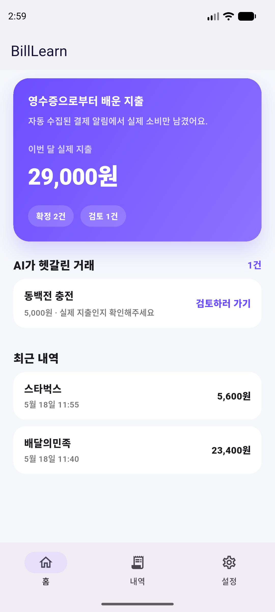

#### Home Layout Review

시안의 상단 지출 요약 영역과 최근 거래 카드 구조에 맞춰 재구성한 홈 화면 캡처입니다.

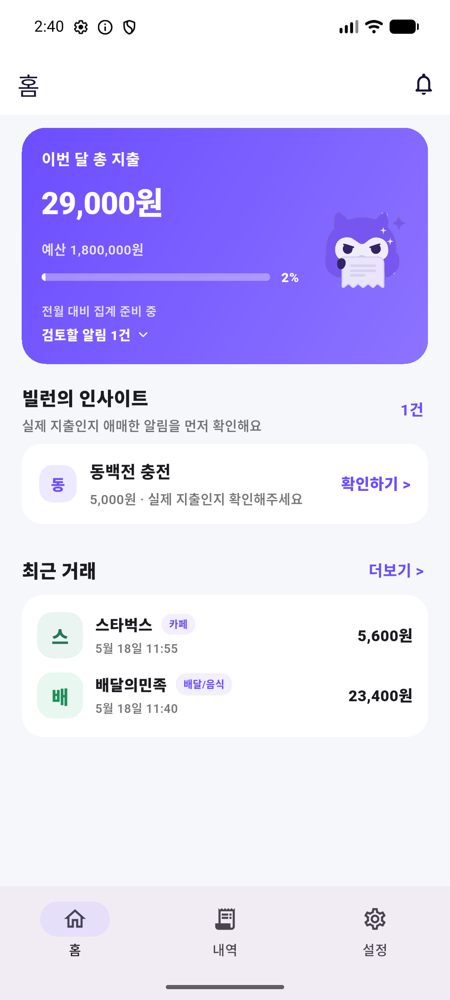

#### Home UI Polish With Asset Reference

Figma 무료 에셋은 앱에 직접 번들하지 않고, 보라 그라디언트 카드와 둥근 패널의 참고 방향만 반영한 캡처입니다.

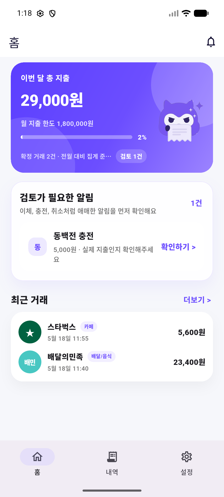

#### Home UI Polish Font Pass

큰 글자 환경에서 히어로 카드 하단 문구와 검토 카드 보조 문구가 잘리지 않도록 문구 길이와 여백을 보정한 캡처입니다.

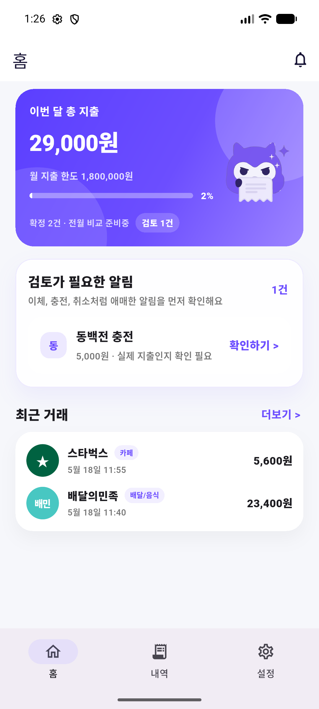

확인 포인트:

- `이번 달 총 지출`, 월 지출 한도, 진행률, 전월 대비 상태, 검토 알림 수를 한 카드에 배치
- 히어로 카드 오른쪽에 브랜드 마스코트 노출
- 최근 거래를 흰 rounded card 안에 compact list로 표시
- 가맹점 로고는 아직 정식 asset이 아닌 merchant-specific fallback
- 에뮬레이터 글자 크기 기준으로 히어로 하단 문구와 검토 카드 보조 문구가 잘리지 않음

#### Home Merchant Icons

최근 거래 리스트에서 가맹점별 색상/라벨 fallback을 적용한 캡처입니다.

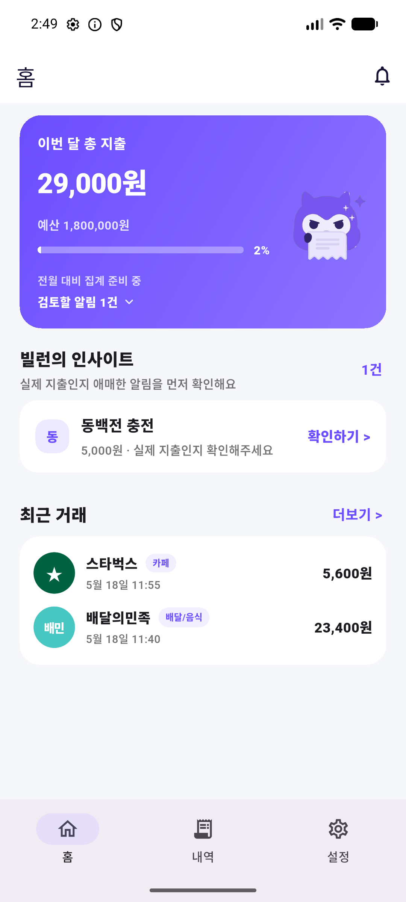

확인 포인트:

- `스타벅스`, `배달의민족`이 단순 초성 placeholder보다 브랜드 식별성이 높은 아이콘으로 표시됨
- 정식 로고 asset 없이도 최근 거래 리스트의 시각 밀도가 시안에 가까워짐
- 이후 실제 로고 asset이 준비되면 merchant mapping만 교체 가능

#### Home Spending Limit Copy

수입/입금 기능이 없는 MVP 범위에 맞춰 `예산` 문구를 `월 지출 한도`로 바꾼 캡처입니다.

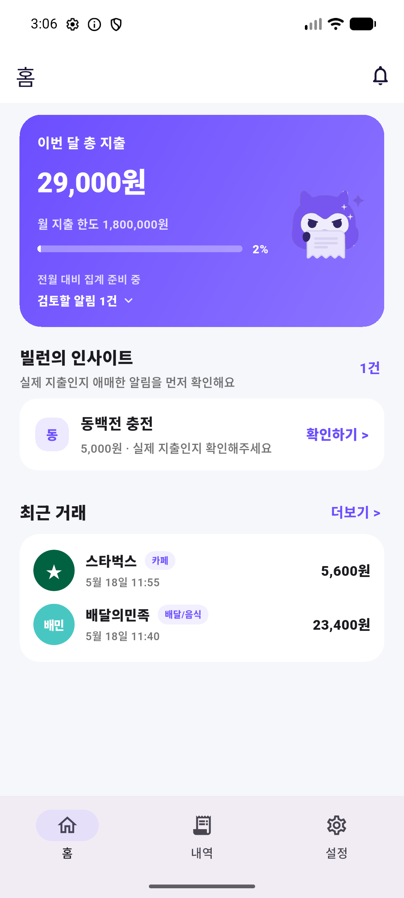

확인 포인트:

- 잔액 기반 예산처럼 보이지 않고 소비 한도 의미로 읽힘
- 진행률 UI는 유지하면서 MVP 기능 범위와 문구가 맞아짐

확인 포인트:

- 확정 지출 총액 `29,000원`
- 확인 필요 거래 `동백전 충전`
- 최근 확정 지출 `스타벅스`, `배달의민족`

#### Home Empty State

앱 데이터가 없는 첫 실행 상태에서 빈 거래 안내와 브랜드 마스코트가 함께 노출되는지 확인한 캡처입니다.

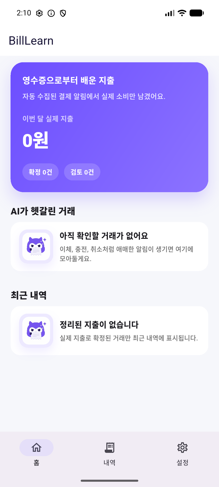

확인 포인트:

- `AI가 헷갈린 거래`, `최근 내역` 빈 상태에 마스코트 SVG 노출
- 결제 알림 수집 전에도 홈의 브랜드 인지 유지
- bottom navigation과 빈 상태 카드 간 간섭 없음

### History

내역 화면은 확정/검토/제외 상태를 함께 보여주는 거래 리스트입니다.

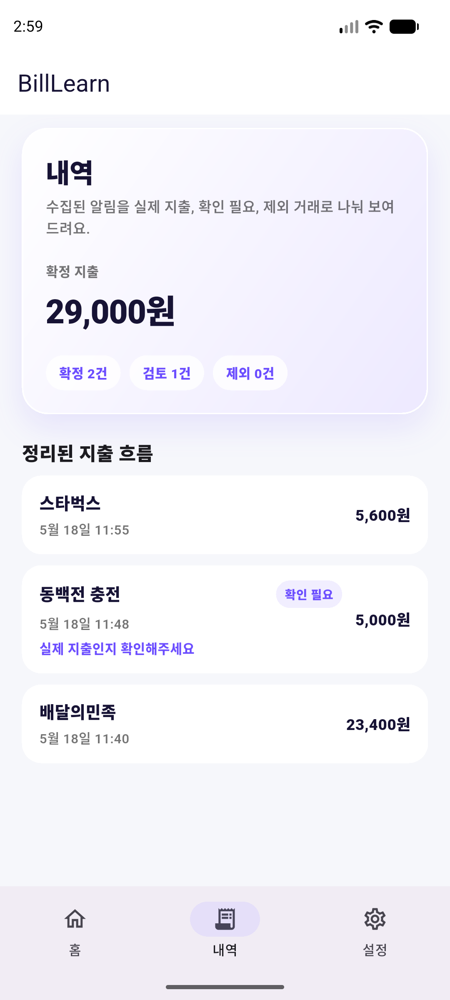

#### History Reference Layout

시안의 내역 화면 구조에 맞춰 필터 row, compact summary, 일자 그룹, 거래 묶음 카드를 반영한 캡처입니다.

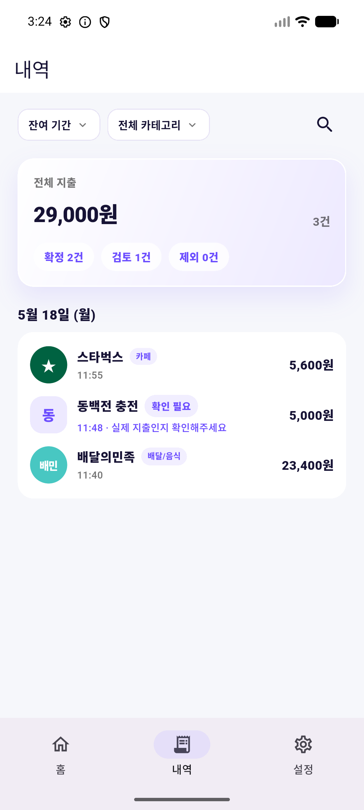

#### History UI Polish

홈 화면과 같은 시각 언어에 맞춰 내역 요약 카드와 날짜별 거래 묶음 카드의 라운드/그림자/문구 밀도를 보정한 캡처입니다.

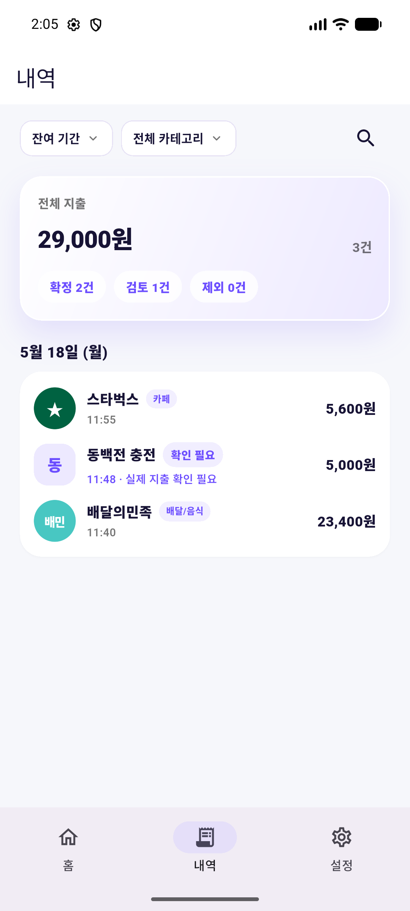

확인 포인트:

- `잔여 기간`, `전체 카테고리`, 검색 아이콘으로 상단 탐색 구조를 배치
- 전체 지출 합계와 거래 건수를 compact summary card로 표시
- 날짜 헤더 아래 같은 날짜 거래를 하나의 흰 rounded card로 묶음
- 홈과 같은 merchant fallback icon/category chip을 내역에서도 사용
- `확인 필요` 거래의 보조 문구가 큰 글자 환경에서도 짧게 유지됨
- 확정 지출 `2건`
- 검토 거래 `1건`
- `확인 필요` 상태 chip과 안내 문구

### Transaction Detail

상세 화면은 거래 금액, 거래 정보, 사용자 피드백, 판별 근거를 순서대로 보여줍니다.

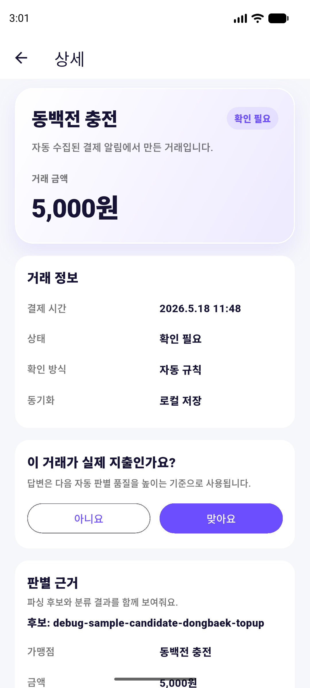

확인 포인트:

- `동백전 충전`이 확인 필요 거래로 표시됨
- `맞아요` / `아니요` 피드백 동선
- 파싱 후보와 판별 근거 진입부

#### Transaction Detail Evidence

상세 화면을 하단까지 스크롤했을 때 파싱 후보, 판별 결과, reason code가 노출되는지 확인한 캡처입니다.

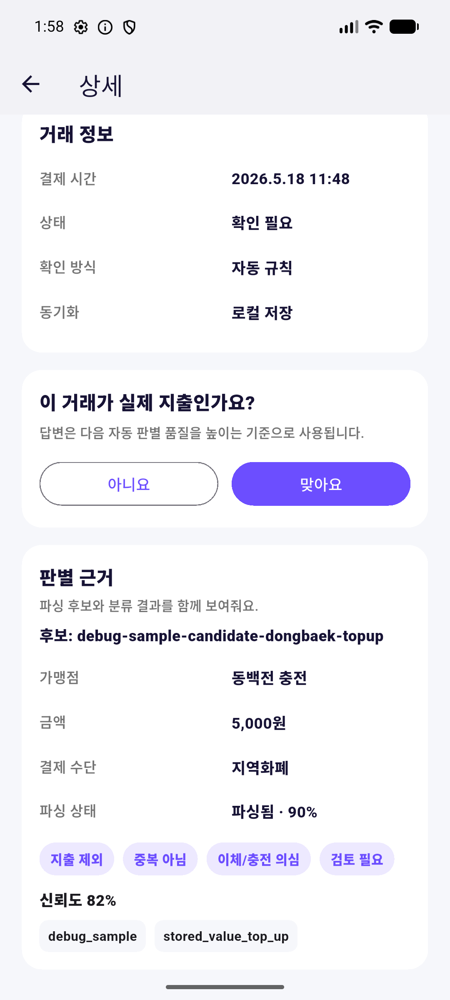

#### Transaction Detail User Evidence

판별 근거를 사용자용 설명, 수집된 원본 알림, 개발자용 reason code로 분리한 캡처입니다.

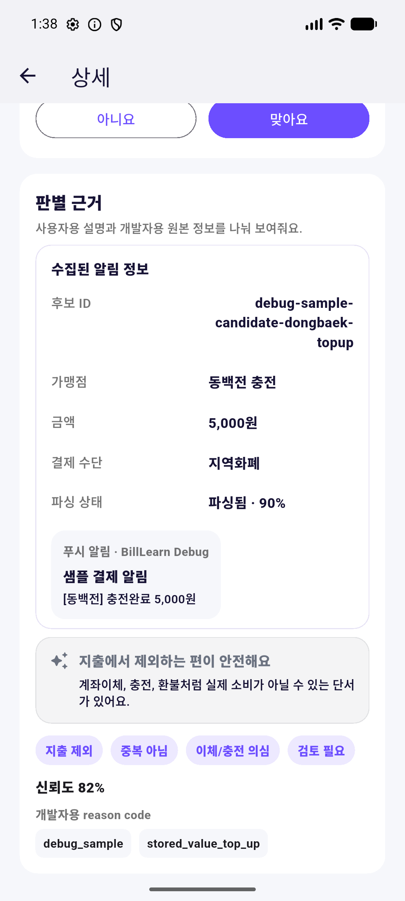

#### Transaction Detail UI Polish

홈/내역 화면과 같은 라운드, 그림자, 연한 보라 그라디언트 표현을 상세 화면에도 맞춘 캡처입니다.

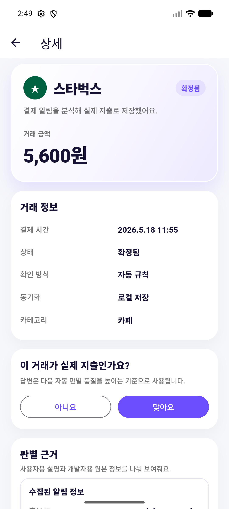

확인 포인트:

- 후보 ID와 가맹점/금액/결제 수단
- 사용자가 이해할 수 있는 `지출에서 제외하는 편이 안전해요` 설명
- 원본 푸시/SMS 알림 body
- `지출 제외`, `중복 아님`, `이체/충전 의심`, `검토 필요` 판별 chip
- 신뢰도와 `debug_sample`, `stored_value_top_up` reason code
- 긴 가맹점명은 히어로 카드에서 한 줄 말줄임 처리

### Settings

설정 화면은 권한 상태, 개발자용 샘플 데이터 생성, 수집 진단을 확인하는 화면입니다.

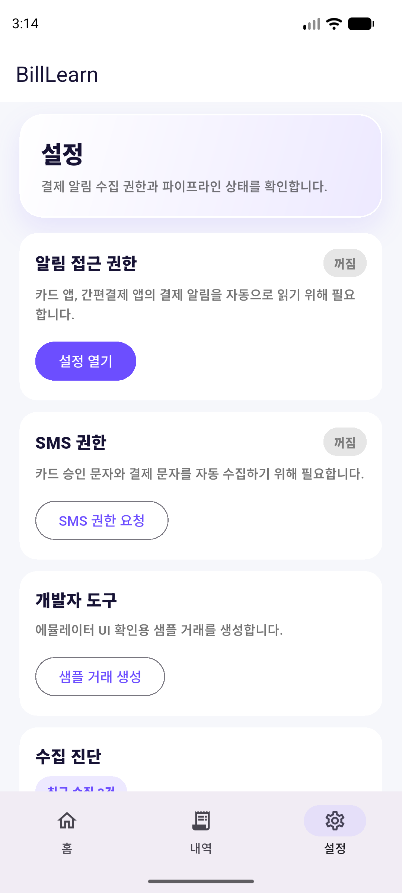

#### Settings UI Polish

홈/내역/상세와 같은 연한 보라 히어로 카드, 둥근 권한 카드, 깊이감 있는 설정 카드 표현을 적용한 캡처입니다.

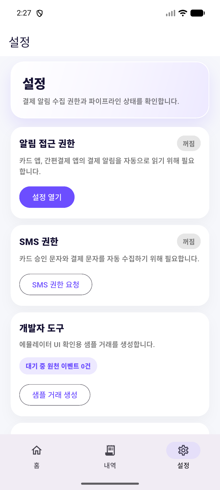

#### Settings Pending Queue Diagnostics

Android native pending queue 잔여 건수를 설정 화면 개발자 도구에서 확인한 캡처입니다.

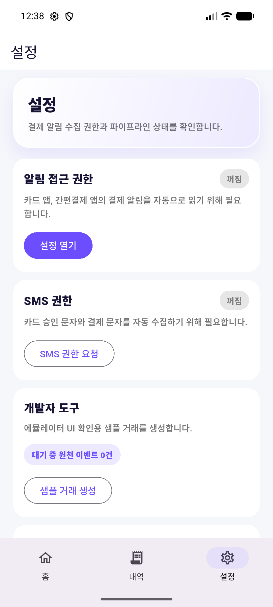

확인 포인트:

- 알림 접근 권한 / SMS 권한 상태
- debug mode 전용 `대기 중 원천 이벤트 0건`
- debug mode 전용 `샘플 거래 생성`
- 수집 진단 카드 진입부
- 설정 카드가 홈/내역/상세와 같은 라운드와 그림자 깊이를 유지

### Settings Diagnostics

수집 진단 하단까지 스크롤했을 때 bottom navigation에 콘텐츠가 가리지 않는지 확인한 캡처입니다.

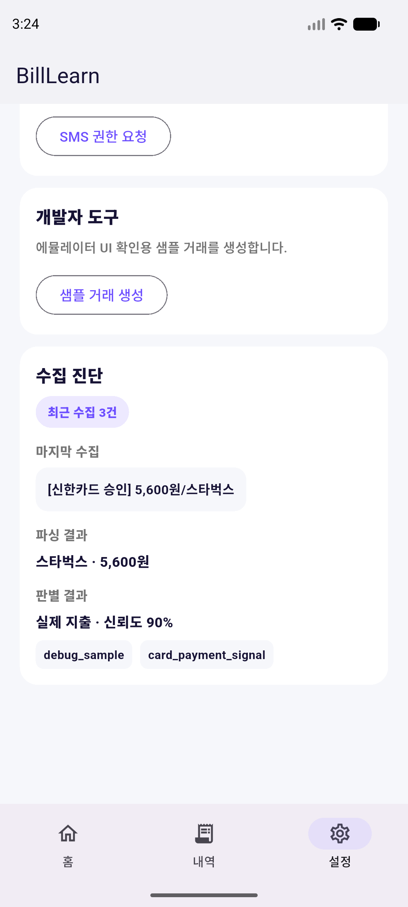

확인 포인트:

- 최근 수집 건수
- 마지막 raw notification body
- 파싱 결과
- 판별 결과와 reason code

## Legacy Empty-State Captures

초기 UI 상태 비교용으로 보관한 이전 빈 상태 캡처입니다.

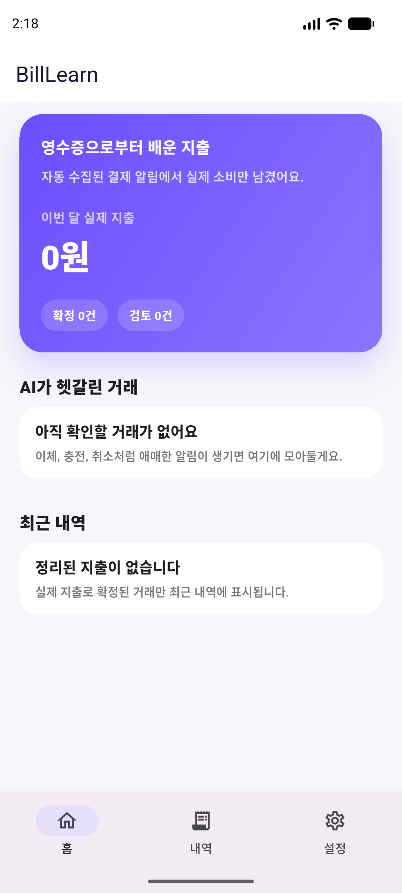

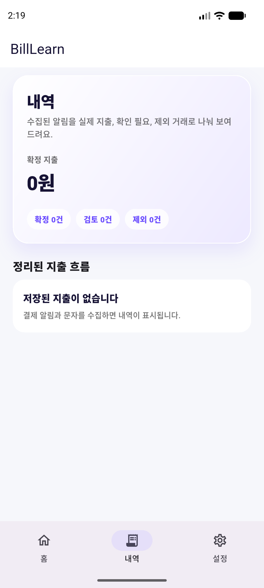

## Current UI Gaps

- UI 스크린샷을 README에 일부 노출할지, 문서 링크만 유지할지 결정이 필요합니다.
